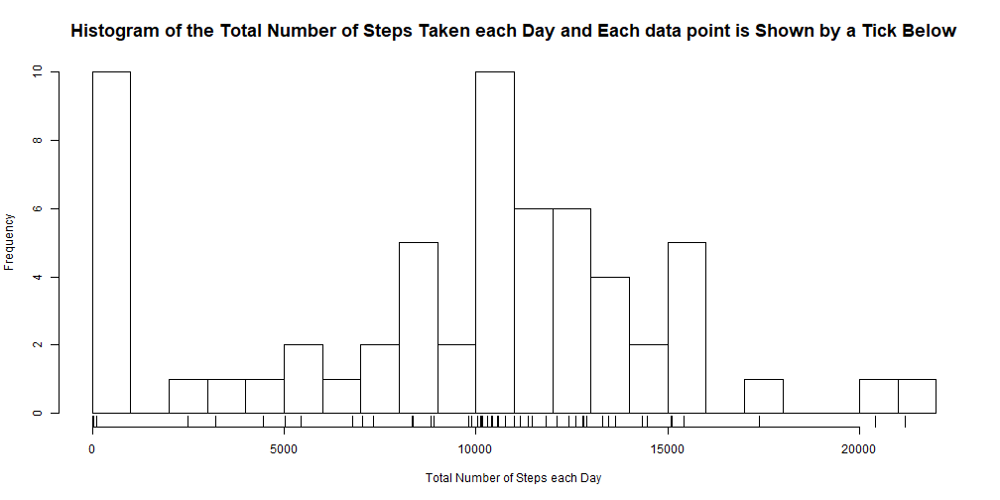
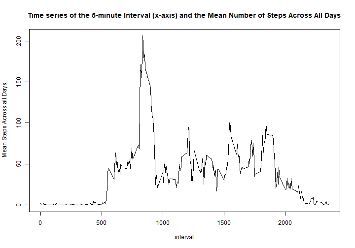
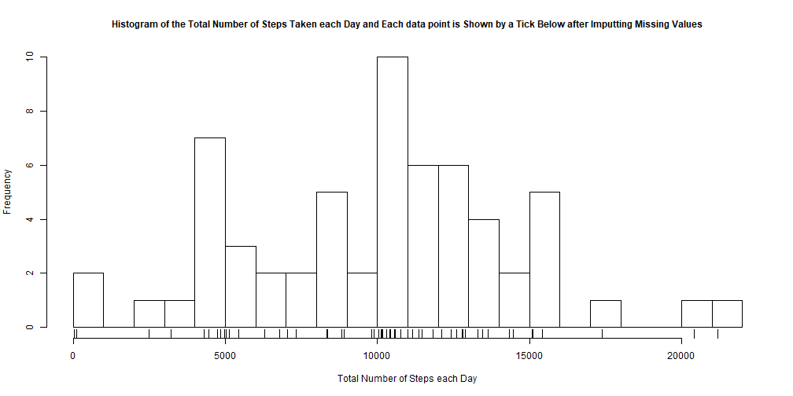
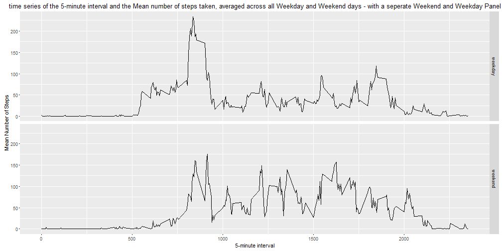

Assignment Two
======================================================================================================
By Elias Kellow

  
##Introduction     

Devices - like a smartphone or smartwatch - can now do a multiedu of task, like email someone, make calls, etc.  Also, devices sense what activities a person is doing.  In our case, the activity is how many steps a person makes.  

For example, an anoymous person - using his device like a smartphone or smartwatch - gathers data about how many steps a person makes throughout the day. This device gathers how many steps this person every five minutes, throughout the day.  The device convocated two months worth of data and then the anoymous person assembled this data into a file.    

In this report, I will explore and analyse this data. But before exploring/analysising this file,  I formulated questions that concentrates and focuses my analysis. For example, concerning the **number** of **steps** each **day** of the above person - what are the key summary statistics, e.g. mean and mode. The other key questions are what:

* **Time-interval** during the day does the **maximum number** step occur.
* Are **differences** between weekends and weekdays for the mean number of steps, per **5-minute** intervals.  

The ultimate goal of this report is to make make clear - for me and others - the analtical process to explore and scrutinize the above questions - getting to know the data.  This analytical process manpulitates data and uses method to form insights.  

It is hoped the reader may reproduce the analysis and validate the analysis.  In other words, the reader can determine if I used the appropriate methods in my analysis.  

Thus, I will discuss the:  

1. My computer and the software it contains.
2. Code for reading in the dataset and/or processing the data.
3. Histogram of the total number of steps taken each day.
4. Mean and median number of steps taken each day.
5. Time series plot of the average number of steps taken.
6. The 5-minute interval that, on average, contains the maximum number of steps.
7. Code to describe and show a strategy for imputing missing data.
8. Histogram of the total number of steps taken each day after missing values are imputed.
9. The mean and median total number of steps taken per day after missing values are imputed
10. Panel plot comparing the average number of steps taken per 5-minute interval across weekdays and weekends.

##Main

###My computer and the Software it Contains.

Firstly, I will discuss my computer and the software inside it in order to give background to the reader.  I hope this aids the reader to reproduce the code below for themselves.

My computer is a **Acer** Laptop and it contains a computer processor called intel i5.

On this computer the:

* Operating evironment is Windows 10 Pro 8 x64 (build 9200).
* RStudio Version is 1.1.453.
* R version 3.3.2 (2016-10-31).
* Attached R base packages are stats, graphics, grDevices, utils, datasets, methods, base.
* Other attached R packages are RevoUtilsMath_10.0.0, RevoUtils_10.0.2, RevoMods_10.0.0, MicrosoftML_1.0.0, mrsdeploy_1.0, RevoScaleR_9.0.1, lattice_0.20-34, rpart_4.1-10
* Load R namespaces (and not attached) are Rcpp_0.12.7, codetools_0.2-15, CompatibilityAPI_1.1.0, digest_0.6.10, foreach_1.4.3, grid_3.3.2, R6_2.2.0, jsonlite_1.1, evaluate_0.14, curl_2.2, rmarkdown_1.13, iterators_1.0.8, tools_3.3.2, xfun_0.8, yaml_2.2.0, htmltools_0.3.5, knitr_1.23, mrupdate_1.0.0

###Code for reading in the dataset and/or processing the data  

Here's the code for reading the [dataset][1] on my computer.  


```r
#1. step one - create a url for the dataset
url<-"https://d396qusza40orc.cloudfront.net/repdata%2Fdata%2Factivity.zip"

#2. step two - set working directory to desktop.  In the next code of line, alter the code by matching the file path to your desktop.
setwd("C:/Users/Elias/Desktop")

#3. step three - create the working directory
if (!file.exists("Activity")){dir.create("Activity")}

#4. step four - set the working directory to the folder Activity.  

setwd("../Desktop/Activity")

#5. step five - download the file from the fileUrl. Downloaded 11/07/2019

download.file(url, destfile = "../Activity/activity.zip")

#6.step six - unzip the file called activity.zip

unzip(zipfile = "../Activity/activity.zip")

#7. step seven - load the 'activity.csv'
activity <- read.csv("activity.csv")
```

Here's the code for processing the dataset.


```r
library(lubridate)
#8. step eight - convert the column date from factor to date data type.
activity$date<- ymd(activity$date)
```

###Histogram of the Total Number of Steps taken Each Day

Devices - mobile watches and phones - now monitor and measures how many steps a person takes. Here's the code for finding the histogram of the total number of steps taken each day.


```r
#9. step nine - group by each day, and find total number of steps taken each day
library(dplyr)
GroupEachDay<-activity %>% group_by(date) %>%
        summarise(SumSteps= sum(steps, na.rm = TRUE))

#10. step ten - create a histogram of total number of steps taken each day
hist(GroupEachDay$SumSteps, main = "Histogram of the Total Number of Steps Taken each Day and Each data point is Shown by a Tick Below", xlab = "Total Number of Steps each Day", breaks = 25, cex.main=1.5)
rug(GroupEachDay$SumSteps, lwd = 1.5)
```



###Mean and Median Number of Steps taken Each Day

Here's the code for finding the mean and median number of steps taken each day.


```r
#11. step eleven - group by each day, and find mean and median number of steps taken each day
MeanMedianEachDay<-activity %>% group_by(date) %>%
        summarise(Mean_Steps= mean(steps, na.rm = TRUE), Median_Steps=median(steps, na.rm = TRUE)) %>%
        mutate(day=date)

#12. step twelve - calculate the mean total number of steps taken per day
mean<-mean(MeanMedianEachDay$Mean_Steps, na.rm = TRUE)

#13. step thirteen - calculate the median total number of steps taken per day
median<-median(MeanMedianEachDay$Median_Steps, na.rm = TRUE)
```

The mean and median total number of steps taken are **37.3825996** and **0**, respectively.


##Time series plot of the average number of steps taken

Here's the code for the Time series plot (type="l") of the 5-minute interval (x-axis) and the average number of steps taken, averaged across all days (y-axis).

```r
#14. step fourteen - group by the column interval.
#Then find the the mean for each interval across all days
MeanMedianInterval<-activity %>% group_by(interval) %>%
        summarise(Mean_Steps= mean(steps, na.rm = TRUE)) 

#15.  step fifthteen - plot time series plot (type="l") of the 5-minute interval (x-axis) and the average number of steps taken, averaged across all days (y-axis)
plot(MeanMedianInterval$interval, MeanMedianInterval$Mean_Steps, type = 'l', xlab = "interval", ylab = "Mean Steps Across all Days", main = "Time series of the 5-minute Interval (x-axis) and the Mean Number of Steps Across All Days")
```



###The 5-minute interval that, on average, contains the maximum number of steps

Here's the code to find the 5-minute interval that, on average, contains the maximum number of steps.  The goal is to find the 5-minute interval between y and x where the maximum number of steps occured.


```r
#16. step sixteen - find the interval (y) that, on average, contains the maximun number of steps 
y<-MeanMedianInterval[which.max(MeanMedianInterval$Mean_Steps),1]

#17. step seventeen - subtract 5 from the variable y to find x.
x<-MeanMedianInterval[which.max(MeanMedianInterval$Mean_Steps),1]-5
```
The maximum number of steps occured between the 835 to 830 interval.

###Code to Describe and Show a Strategy for Imputing Missing Data.

Here's the code to Calculate and report the total number of missing values in the dataset (i.e. the total number of rows with NAs).


```r
#18. step eighteen - find where na values occur
missing<-is.na(activity$steps)

#19. step nineteen - find how many na values
length<-length(missing)
#percent<-mean(missing)*100
```

The total number of missing values in the dataset are **17568**.

Here's the code to impute missing data. I replaced missing rows using the 10 nearest rows.  Instead of 10, I may have chosen 1, 2, 3 - or any positive integer - nearest rows, and this is called K nearest neighbour approach. I found the *'impute'* library from [bioconductor][2].


```r
library(impute)
#20. step 20 - the dataframe activity needs to be changes to matrix
#this is required for the impute.knn() in the next step
activity2<-data.matrix(activity)

#21. step 21 - impute missing missing values using the 10 nearest  neighbours
activity3<-impute.knn(activity2)$data

#22. step 22 - change the matrix - activity3 - to a dataframe called activity4
activity4<-data.frame(activity3)

#23. step 23 - fix the column activity$data
activity4$date<-activity$date
```


###Histogram of the total number of steps taken each day after missing values are imputed


Here's the code to find the histogram of the total number of steps taken each day after missing values are imputed.

```r
#24. step 24 - group by each day, and find total number of steps taken each day
library(dplyr)
GroupEachDay<-activity4 %>% group_by(date) %>%
        summarise(SumSteps= sum(steps, na.rm = TRUE))

#25. step ten - create a histogram of total number of steps taken each day
hist(GroupEachDay$SumSteps, main = "Histogram of the Total Number of Steps Taken each Day and Each data point is Shown by a Tick Below after Imputting Missing Values", xlab = "Total Number of Steps each Day", breaks = 25, cex.main=1)
rug(GroupEachDay$SumSteps, lwd = 1.5)
```



When I replaced missing values - using the 10 nearest neighbour - the previous histogram looks like two normal distributions.  When I did not replace missing values, the histogram looks more like one normal distribution - see the first graph.  The previous histogram seems to have two peaks, i.e. a bimodal distribution.  This suggest two people using the device.

###The mean and median total number of steps taken per day after missing values are imputed

Here's the code to find the mean and median total number of steps taken per day after imputting/replacing missing values.


```r
#26. step eleven - group by each day, and find mean and median number of steps taken each day
MeanMedianEachDay<-activity4 %>% group_by(date) %>%
        summarise(Mean_Steps= mean(steps, na.rm = TRUE), Median_Steps=median(steps, na.rm = TRUE)) %>%
        mutate(day=date)

#27. step twelve - calculate the mean total number of steps taken per day
meanMissing<-mean(MeanMedianEachDay$Mean_Steps)

#28. step thirteen - calculate the median total number of steps taken per day
medianMissing<-median(MeanMedianEachDay$Median_Steps)
```

When I replaced missing values, the mean and median total number of steps taken are **34.7317472** and **0**, respectively.  When I replaced missing values - the mean is lower than when I did not replace missing values.


###Panel plot comparing the average number of steps taken per 5-minute interval across weekdays and weekends

Here's to find the plot comparing the average number of steps taken per 5-minute interval across weekdays and weekends - so weekends and weekdays will have seperate plots.


```r
#29. step 29 - create a column that states the day of week, e.g. mondays, etc
activity$'weekday'<-weekdays(activity$date)

#30. step 30 - create a column that states if weekday or weekend.
activity$'daytype'<-ifelse(activity$weekday=="Saturday"|activity$weekday=="Sunday", "weekend", "weekday")

#31. step 31 - group by interval then find the mean across all days by each interval
MeanInterval<-activity %>% group_by(interval, daytype) %>%
        summarise(Mean_Steps= mean(steps, na.rm = TRUE))

#31.  step 31 - plot time series plot (type="l") of the 5-minute interval (x-axis) and the average number of steps taken, averaged across all days (y-axis)
library(ggplot2)
qplot(interval, Mean_Steps, data = MeanInterval, facets = daytype~., geom = "line", main = "time series of the 5-minute interval and the Mean number of steps taken, averaged across all Weekday and Weekend days - with a seperate Weekend and Weekday Panel", xlab = "5-minute interval", ylab = "Mean Number of Steps")
```



[1]: https://d396qusza40orc.cloudfront.net/repdata%2Fdata%2Factivity.zip "dataset"
[2]: http://bioconductor.org "bioconductor"
 
